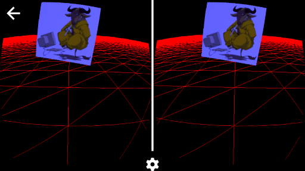

# Cordova VR with Three.js on Android (and more!)

Build a VR application for mobile and desktop devices, using:

 - Three.js to create attractive 3D scenes
 - Crosswalk for increased WebGL performance
 - Polyfills for devices that do not support WebVR yet
 - Cordova to deploy the webview as an app

Check out the [demo](https://zedr.github.io/cordova_vr/www/)!

Based on https://github.com/borismus/webvr-boilerplate

## TODO

 - Babel and Webpack integration
 - XM playback using Webworkers
 - Stereo sound
 - Performance optimisations
